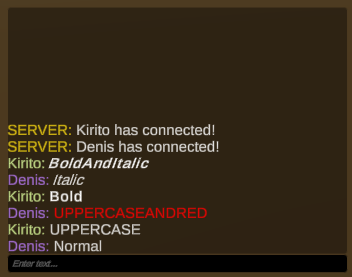
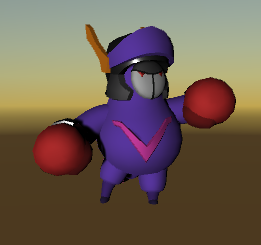
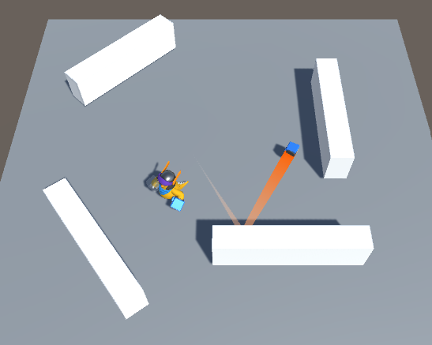

# Handball Fu
Handball Fu is a multilplayer party game where you kill your friends throwing your fist. 
You can hide transforming into elements of the environment.

## Features
+ Character costumization
+ Chat multiplayer
+ Send message with styles
+ Dash
+ Hide (Prophunt)
+ Shoot a custom ball
+ Aim still, release and shoot

## Controls
Custom Scene:
+ Arrows Left and Right: Change cosmetic
+ Arrow Up and Down: Select body part
+ AD / Joystick: Rotate avatar
+ Enter: Send message

Lobby:
+ WASD / Left Stick: Move
+ J / Button South: Dash
+ K / Button West: Shoot
+ L / Button North: Hold to aim, release to shoot
+ None control: After x seconds you transform into random object

### Galery
Stylized Messages

 
 
 Custom avatar
 
 
 
 Ball bound
 
 
